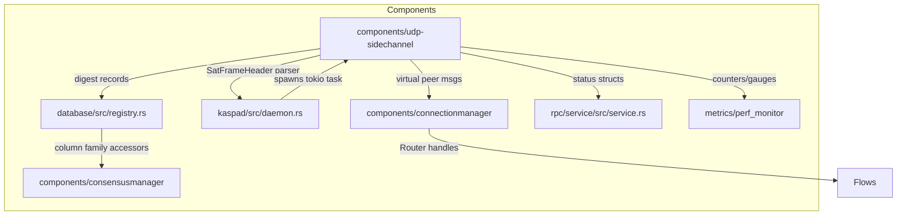

# UDP Side-Channel Ingest Implementation Plan

Digest-first, satellite-primed UDP ingest path for `rusty-kaspa`, keeping consensus untouched while providing optional BlockV1 scaffolding for lab/testnet. This plan turns the PRD and research doc into actionable work packages with explicit safety, observability, and rollout guard-rails.

Sources reviewed:
- [research/gpt.md](research/gpt.md)
- [docs/prd.md](docs/prd.md)

## 1. Scope & Non-Scope
**Scope**
- Localhost UDP listener that ingests framed `DigestV1` (primary) and optional `BlockV1` payloads without disturbing TCP P2P flows.
- Digest pipeline: signature verification, bounded buffering, RocksDB-backed retention, RPC + Prometheus surfacing, divergence flagging.
- Optional block ingestion via a virtual Router peer so satellite blocks traverse existing validation flows identically to TCP peers.
- Feature flag, CLI/config plumbing, metrics, operator docs, fuzz/property/integration tests, and PoC tooling for UDP generators.

**Non-Scope**
- Any consensus rule/tokeneconomic change; no direct DAG mutations from digests.
- RF/PHY handling, FEC generation, or satellite transport specifics (expect a repaired UDP feed).
- Guaranteeing IBD over UDP; LoRa/HF/mesh gateways are defered but must be compatible with the same framing.
- Production commitment to block mode; it remains dev/test only until telemetry proves viability.

## 2. High-Level Architecture Recap
### 2.1 Data Flow
```mermaid
flowchart LR
  SAT[Satellite / UDP generator] -->|framed UDP| UDPsock((tokio udp_ingest))
  UDPsock --> Frame[frame_reassembler\n+ CRC/FEC]
  Frame -->|DigestV1| Digest[digest_parser\n+ verifier]
  Frame -->|BlockV1 (opt)| Block[block_parser\n+ reassembly]
  Digest --> Store[(RocksDB CF udp_digest)]
  Digest --> RPCs{{RPC + metrics}}
  Block --> Injector[sat_injector queue]
  Injector --> VR[Virtual Router peer]
  VR --> Flows[Existing p2p flows]
  Flows --> CM[Consensus Manager]
  CM --> Pipeline[Consensus pipeline]
  Pipeline --> DB[(RocksDB state)]
```

### 2.2 Component Map


**Multi-producer note:** `SatFrameHeader` carries a bounded `source_id: u16` so the node can ingest concurrent feeds (e.g., two teleports) while keeping Prometheus cardinality capped. Per-source health appears only via RPCs/CLI; metrics expose aggregate totals with fixed labels.

## 3. Phased Delivery Plan
Quality bars apply to every phase and must be tracked explicitly (validated by the Phase 4 `udp_ci_guard` job):
- No consensus mutations originate from digests; block mode must still traverse normal validation.
- Parser paths never panic on untrusted input; all allocations/ring buffers stay bounded and fuzz harnesses must remain crash-free within 60 s.
- Sustain ~10 kbps digest processing with ≤ 15% CPU overhead compared to baseline at the same load; CI fails if the guard detects higher deltas.
- Divergence signalling remains observable (RPC + metric) as soon as the feature can compare digests vs local state.
- Default bind is `127.0.0.1:28515`; non-loopback binds error unless explicitly allowed or a Unix datagram socket is configured.

### Phase 0 — Planning & Branch Setup
**Objective:** Establish governance artefacts: this plan, branch `udp`, Draft PR, and CI visibility.

**Rationale:** Sets the cadence mandated by the working agreement and ensures stakeholders can review before code lands.

**Entry prerequisites:** None beyond repo access.

**Exit / Acceptance criteria:**
- `plan.md` created in `/udp`, reviewed, and referenced by Draft PR.
- Git branch `udp` cut from current master/main; Draft PR open with checklist referencing this plan.
- CI status badges/links in PR description.

**Risks & mitigations:**
- *Risk:* Plan drifts from implementation. *Mitigation:* Update `plan.md` after every task (mandated), block merges until plan is accurate.
- *Risk:* Branch diverges from master. *Mitigation:* Rebase/merge before each phase exit.

**Quality bars:** Remainder tracked via plan updates; no functional code yet but document must call them out for later verification.

**Tasks**
- [ ] **Author & land plan.md + workflow notes**  
  - What: Create this plan with full structure, references, and cadence reminders.  
  - Where: `udp/plan.md`.  
  - Artefacts: `plan.md` with diagrams, phased tasks, open questions.  
  - Tests: `markdownlint` (if available) or visual inspection; run `cargo fmt -- --check` not needed yet but keep workspace clean.  
  - DoD: Plan approved (human review) before any production code begins.
- [ ] **Create branch + Draft PR scaffolding**  
  - What: `git checkout -b udp`, push, and open Draft PR pointing to master/main.  
  - Where: repo root.  
  - Artefacts: Remote branch `udp`, Draft PR referencing `plan.md`.  
  - Tests: CI smoke (`cargo test --workspace -q`, `cargo fmt -- --check`, `cargo clippy --workspace -- -D warnings`) to prove clean baseline.  
  - DoD: Draft PR shows green CI, links to plan, and records decisions/notes section.

### Phase 1 — UDP Ingest Scaffolding (socket, config, flags, logging)
**Objective:** Introduce feature flag/config plumbing, initialise runtime task, and ensure the node can bind a UDP socket safely while defaulting to disabled mode.

**Rationale:** Foundational wiring needed before any parsing or storage can occur; ensures operators can enable/disable safely.

**Entry prerequisites:** Phase 0 complete; master merged; baseline tests green.

**Exit / Acceptance criteria:**
- CLI + TOML options (`--udp.*`, `[udp]`) parsed into runtime config with sane defaults (disabled, digest-only, 10 kbps cap, listen `127.0.0.1:28515`).
- Binding to any non-loopback interface fails fast unless `--udp.allow_non_local_bind=true`; Unix datagram listening via `--udp.listen_unix=/run/kaspad/udp.sock` is mutually exclusive with UDP socket configuration and defaults to `/run/kaspad/udp.sock` in packaged Linux builds (0640 perms, systemd drop-in ensures directory).
- UDP task spins up only when enabled, handles bind failures gracefully, enforces transport neutrality (loopback/Unix only by default), and logs structured status with `udp.event`.
- Feature defaults keep behaviour identical to baseline when disabled (AC-1).
- Acceptance test: enabling/disabling via admin RPCs (Phase 3) honours config without restart; binding guard verified by integration test.

**Risks & mitigations:**
- *Risk:* Config drift between CLI and TOML. *Mitigation:* Single `UdpConfig` struct reused by both entry points plus integration test covering CLI/TOML parity.
- *Risk:* Socket misbehaviour blocks startup. *Mitigation:* Bind in dedicated tokio task with timeout and fallback to normal operation; structured logging plus admin RPC kill-switch for recovery.
- *Risk:* Local spoofing on shared hosts. *Mitigation:* Loopback-only default, optional Unix datagram path with filesystem ACLs, `--udp.allow_non_local_bind` flagged as advanced/unsafe.

**Quality bars:**
- No consensus mutation (feature still off by default).
- Parser safety ensured by dropping any payload > configured cap even before parser exists; network_id mismatches dropped (Phase 2) but the guard is called out here.
- CPU overhead negligible (only idle task) — verify via baseline perf sample.
- Divergence signalling flagged as TODO in metrics; absence tracked as risk note in plan.

**Tasks**
- [x] **Config schema + CLI plumbing** *(done — `kaspad/src/args.rs` now exposes `[udp]` TOML + `--udp.*` flags with validation/defaults)*  
  - What: Extend CLI/TOML parsing with `[udp]` and flags described in PRD plus bind safety knobs: `enable`, `listen` (default `127.0.0.1:28515`), `allow_non_local_bind` (default `false`), `listen_unix` (mutually exclusive, default `/run/kaspad/udp.sock` on Linux packages), `mode`, `max_kbps`, `require_signature`, `allowed_signers`, `digest_queue`, `block_queue`, `discard_unsigned`, `db_migrate`, `log_verbosity`.  
  - Where: `kaspad/src/args.rs`, `core/src/config/mod.rs` (or equivalent), `core/src/config/defaults.rs`.  
  - Artefacts: `UdpConfig` struct, `ConfigBuilder` wiring, docs comments, systemd drop-in snippet for `/run/kaspad`.  
  - Tests: `cargo test -p kaspad args::tests::udp_defaults`; add CLI/TOML round-trip unit tests; integration test proving non-loopback bind rejected without flag.  
  - DoD: Running `kaspad --help` lists new flags; default config serialises with `[udp]` commented out, loopback enforced, Unix socket path documented.
- [x] **Runtime feature-gate & tokio task scaffold** *(done — new `kaspa-udp-sidechannel` crate + `UdpIngestService` registered via `AsyncRuntime`, enforcing loopback-only binds and Unix socket perms)*  
  - What: Add `udp` feature flag (build + runtime), spawn `udp::ingest::run(config, shutdown)` inside `kaspad/src/daemon.rs` when enabled.  
  - Where: `kaspad/src/daemon.rs`, new crate `components/udp-sidechannel/src/lib.rs`.  
  - Artefacts: `UdpIngestHandle`, `ShutdownGuard`, log events for bind success/failure with `udp.event=bind_ok|bind_fail` and `remote=loopback|unix`.  
  - Tests: `cargo test -p components-udp-sidechannel ingest::tests::bind_disabled`; integration smoke test enabling/disabling via `kaspad` e2e harness; verify admin RPC `udp.disable` drains task without restart; Unix-socket integration test asserting perms 0640, non-member users cannot write, and admin RPCs reachable via Unix transport.  
  - DoD: Enabling flag binds socket (UDP or Unix) and logs readiness; disabling leaves no extra tasks; virtual killswitch works; Unix path security validated.
- [x] **Telemetry skeleton** *(done — `UdpMetrics` counters wired into service loops, added Unix socket permission tests and plan updates)*  
  - What: Register base metrics counters/gauges (frames_total, rx_kbps) and log categories.  
  - Where: `metrics/perf_monitor/src/lib.rs`, `components/udp-sidechannel/src/metrics.rs`.  
  - Artefacts: Metrics registration APIs, initial counters incremented on socket activity; enforce bounded label sets (`kind`, `reason`, `queue`).  
  - Tests: `cargo test -p metrics-perf_monitor metrics::tests::udp_registration`.  
  - DoD: Metrics endpoint exposes zeroed UDP metrics when disabled, increments when datagrams received, and never emits dynamic labels (verified in tests).

### Phase 2 — Frame Header Parsing, Bounds Checks, CRC, De-dup Windows
**Objective:** Implement `SatFrameHeader` parsing, fragmentation/FEC bookkeeping, rate caps, and replay/drop logic so only well-formed payloads reach higher layers.

**Rationale:** Defensive parser ensures hostile UDP cannot crash or exhaust resources; aligns with FR-2/FR-3 and binds transport inputs to the correct network.

**Entry prerequisites:** Phase 1 exits satisfied; ingest task receives raw bytes.

**Exit / Acceptance criteria:**
- `SatFrameHeader` parser validates magic/version/kind/network/CRC, captures `source_id: u16`, and enforces payload/fragment size limits while rejecting dynamic label explosion (source IDs surfaced via RPC only).
- Bounded digest/block queues (`digest_queue=1024`, `block_queue=32`) drop excess with metrics/logs.
- Sliding windows per kind reject stale seq numbers and duplicates; rate limiter ensures `max_kbps` compliance.
- Rate limiter preferentially drops delta digests before snapshots; snapshots are only dropped when they alone would violate the hard cap (log reason `drop_class=delta|snapshot` with bounded labels).
- Frames with `network_id` that does not match the running node are dropped with metric `udp_frames_dropped_total{reason="network_mismatch"}` (bounded label) and structured log.
- Metrics and logs never include per-frame identifiers (seq/group ids) beyond bounded `reason/kind/queue`.

**Risks & mitigations:**
- *Risk:* Complex parser panics. *Mitigation:* Use `nom`/manual state machine with exhaustive tests + fuzz harness stub (initial). Always return `Result` errors.
- *Risk:* Incorrect FEC/fragment assembly causing stuck queues. *Mitigation:* Timeouts + instrumentation per group ID.
- *Risk:* Network mixing from multiple telemetry feeds. *Mitigation:* Hard drop on network mismatch, metric for future auditing, optional per-source stats via RPC.

**Quality bars:**
- Parser safety explicitly validated (unit tests + property tests), satisfying non-panic requirement.
- No consensus mutation (still not injecting digests/blocks).
- CPU overhead measured during parser benchmarks (document results in plan notes).
- Divergence signalling still pending; track as risk.

**Tasks**
- [ ] **Header parser & CRC guard**  
  - What: Implement `SatFrameHeader::parse(&[u8]) -> Result<Header, SatIngestError>` plus CRC32 check, `source_id: u16`, version handling (accept only `version=1`, drop >1 with at most one warning per minute), and loopback/Unix provenance markers.  
  - Where: `components/udp-sidechannel/src/frame/header.rs`.  
  - Artefacts: Header struct, error enum, unit tests covering malformed cases from research doc.  
  - Tests: `cargo test -p components-udp-sidechannel frame::tests::header_bounds`; `cargo fmt -- --check`; `cargo clippy -- -D warnings`; property test ensuring network mismatch drop.  
  - DoD: 100% branch coverage for header parser; fuzz stub compiled (Phase 4 extends); mismatched network_id increments bounded metric.
- [ ] **Fragment/FEC assembler**  
  - What: Build `FrameAssembler` handling `group_id`, `group_{k,n}`, `frag_ix`, `frag_cnt`, with expiry timers and byte limits.  
  - Where: `components/udp-sidechannel/src/frame/assembler.rs`.  
  - Artefacts: Per-kind ring buffers, config for max concurrent groups, instrumentation hooks.  
  - Tests: Property test simulating loss/reorder (use `proptest`).  
  - Tests cmd: `cargo test -p components-udp-sidechannel assembler::tests::loss_reorder`.  
  - DoD: Assembler recovers in-order payload for typical cases; drops incomplete groups after timeout with metrics.
- [ ] **Rate limiting + de-dup windows**  
  - What: Token-bucket style limiter tied to `max_kbps`, sliding windows keyed by `(kind, seq, payload_hash)`, with logic that preferentially drops delta digests before snapshots (snapshots only dropped when they alone exceed the cap).  
  - Where: `components/udp-sidechannel/src/runtime/mod.rs`.  
  - Artefacts: Configurable windows, metrics for drops (reason labelled).  
  - Tests: `cargo test -p components-udp-sidechannel runtime::tests::dedup_and_ratecap`.  
  - DoD: `udp_frames_dropped_total{reason="duplicate"}` increments on replay fixture; limiter clamps throughput in integration test replay harness; delta-first drop behaviour verified; sequence windows never appear as labels (only reasons).

### Phase 3 — DigestV1 Parsing, Signature Verification, RocksDB CF Storage, RPCs/Metrics
**Objective:** Complete end-to-end digest path: parse `DigestV1`, verify signatures, persist records, expose RPCs + metrics, and implement divergence signalling.

**Rationale:** Delivers the primary value (digest heartbeat under ~10 kbps) and satisfies FR-4, FR-6, acceptance criteria AC-2/AC-6.

**Entry prerequisites:** Phase 2 parser delivering validated payloads.

**Exit / Acceptance criteria:**
- `DigestV1` snapshot/delta structs parsed with field validation (epoch monotonic, blue score sanity, allowed signer set).
- Schnorr signature verification (secp256k1) enforced when `require_signature` true; rejection logged/metric’d with `udp.event=sig_fail`; runtime reload of `allowed_signers` via `udp.updateSigners` RPC or SIGHUP takes effect in < 5 s without dropping the ingest task.
- New RocksDB CF `udp_digest` stores rolling history with retention controls (default keep last 10,000 digests OR 7 days, whichever first, pruned every minute); DB schema version bumped and guarded by `--udp.db_migrate=true` on first create; when feature disabled existing CF is ignored and startup succeeds.
- `getUdpIngestInfo` + `getUdpDigests` RPCs live, now including `bind_unix`, `source_count`, per-source stats (bounded list), admin controls `udp.enable`, `udp.disable`, `udp.updateSigners`.
- Divergence detector compares latest verified digest vs local consensus head and exposes metric + log; incident runbook drafted (Phase 6) references log keys.
- Digest timestamps checked for sanity (reject > N minutes future/past skew) and metrics surface skew buckets.
- `source_id` optionally binds to specific signer IDs; mismatches are rejected with bounded drop reason `source_signer_mismatch`.
- Admin RPCs are local-only (loopback/Unix) by default; remote calls are rejected unless an existing global guard (e.g., `--rpc.allow_admin_remote=true`) is present, otherwise the UDP-specific override `--udp.admin_remote_allowed=true` (optionally combined with `--udp.admin_token_file`) must be set, with clear error responses.

**Risks & mitigations:**
- *Risk:* DB bloat. *Mitigation:* Configurable retention (count/time) and background pruning job.
- *Risk:* Signature verification latency. *Mitigation:* Batch/separate tokio task, reuse `secp256k1` contexts.
- *Risk:* Divergence false positives. *Mitigation:* Only flip flag after digest verified & matched to consensus anchors; include clock-skew guard to avoid acting on stale frames.
- *Risk:* Signer rotation downtime. *Mitigation:* Hot reload + admin RPC ensures acceptance flips quickly; test case codified.

**Quality bars:**
- Digests do not mutate consensus; they merely store hints and update telemetry.
- Parser safety maintained (Digest parser uses same error discipline).
- CPU overhead measured at 10 kbps with signature verification; document ≤15% delta.
- Divergence signalling implemented (metrics + RPC field) satisfying requirement; admin kill-switch verified.

**Tasks**
- [ ] **Digest parser + signature verifier**  
  - What: Implement `DigestFrame` structures (snapshot + delta), parsing/bounds checks, Schnorr verification using allowed signer cache; enforce sender timestamp sanity (drop frames > 2 min future or > 10 min stale, increment skew metric).  
  - Where: `components/udp-sidechannel/src/digest/mod.rs`, `crypto` crate (if helper functions required).  
  - Artefacts: `DigestRecord`, `DigestVariant`, `SignerRegistry`, skew metric `udp_digest_skew_seconds`.  
  - Tests: `cargo test -p components-udp-sidechannel digest::tests::{snapshot_roundtrip, delta_epoch_guard}` with vector fixtures; property test for epoch monotonicity; time skew fixtures.  
  - DoD: Invalid signatures rejected with `udp_digest_sig_fail_total` incrementing; valid fixtures stored; future-timestamp frames logged/dropped.
- [ ] **Wire-format spec + golden vectors**  
  - What: Produce a concise wire-format spec for `DigestV1` (field order, endianness, domain tag for signatures, `source_id` binding) and publish golden test vectors (hex payload + expected hash/signature) consumed by unit tests (and shareable with external implementations).  
  - Where: `docs/udp/digest-wire-format.md`, `components/udp-sidechannel/tests/vectors.rs`.  
  - Artefacts: Documented spec, serialized fixtures, cross-check test ensuring parser/verifier accept vectors and reject tampered versions.  
  - Tests: `cargo test -p components-udp-sidechannel digest::tests::golden_vectors`.  
  - DoD: Spec checked into repo, tests enforce stability, and signature domain separation string documented.
- [ ] **Persistence layer (RocksDB CF)**  
  - What: Register `udp_digest` CF and accessors, add retention/pruning (rolling window, default 10,000 records or 7 days), introduce schema version bump + `--udp.db_migrate=true` guard for first creation/downgrade safety, and ensure feature-disabled startup ignores CF.  
  - Where: `database/src/registry.rs`, `database/src/access.rs`, new `database/src/udp_digest.rs`.  
  - Artefacts: `UdpDigestStore` trait impl, retention config (count/time), background prune timer, helper tool `udp/tools/cleanup_cf.rs`.  
  - Tests: `cargo test -p database udp_digest::tests::{insert_fetch, retention_prunes, disabled_startup}`.  
  - DoD: Node start-up migrates CF only when flag set; rerun without feature/flag succeeds even if CF exists; offline tool documented for drop.
- [ ] **RPCs & metrics surface**  
  - What: Add operator/admin RPCs: `getUdpIngestInfo`, `getUdpDigests`, `udp.enable`, `udp.disable`, `udp.updateSigners`; enforce local-only access by default (loopback/Unix). If a global admin RPC flag exists (e.g., `--rpc.allow_admin_remote=true`), reuse it; otherwise gate remote access behind UDP-specific knobs `--udp.admin_remote_allowed` (default false) and optional bearer-token auth via `--udp.admin_token_file`. Extend Prometheus gauges/counters (per PRD §9) while keeping label sets bounded. `getUdpIngestInfo` returns `bind_unix`, `source_count`, `sources: [{source_id, last_epoch, last_ts_ms, signer_id}]`.  
  - Where: `rpc/service/src/service.rs`, `rpc/core/src/api.rs`, `metrics/perf_monitor/src/lib.rs`, `kaspad/src/daemon.rs` wiring.  
  - Artefacts: Request/response structs with fields: status, mode, bind/bind_unix, rx_kbps, frames_received/dropped per bounded reason, last digest summary, divergence status, digest list with `epoch, pruning_point, pruning_proof_commitment, utxo_muhash, virtual_selected_parent, virtual_blue_score, daa_score, blue_work, kept_headers_mmr_root?, signer_id, sig_ok, recv_ts_ms, source_id`, admin RPC request structs, hot-signers update path.  
  - Tests: `cargo test -p rpc-service rpc::tests::get_udp_ingest_info_defaults`; integration test scripting generator to produce digests and verifying RPC output; soak test verifying signer update flips acceptance within 5 s without dropping ingest; RPC access-control tests proving (a) local loopback/Unix calls succeed, (b) remote calls are rejected unless either the global flag is set or `--udp.admin_remote_allowed=true` + valid token (if configured) are provided.  
  - DoD: `kasparpc-cli getUdpIngestInfo` returns populated struct when generator is running (including per-source stats); admin RPCs toggle ingest and update signers live; divergence metric toggles when digest disagrees with consensus head.

### Phase 4 — Adverse-Condition & Soak Tests; Performance Guard-Rails; Fuzz Harness
**Objective:** Validate robustness under loss/reorder/replay/malformed frames, run sustained load tests, and land fuzz harness for parser surfaces.

**Rationale:** Directly targets security/perf acceptance criteria (AC-3, AC-4, AC-7) ensuring parser never panics and CPU/memory stay bounded.

**Entry prerequisites:** Phase 3 complete; digest pipeline functional.

**Exit / Acceptance criteria:**
- Automated integration suite covering packet loss, reorder, replay, malformed inputs, and silence detection.
- Soak test (≥24 h, 10 kbps) script with documented CPU/mem metrics ≤ targets.
- `cargo fuzz`/libFuzzer target for `SatFrameHeader` + `DigestFrame` passes CI gating (no crashes, coverage logged).

**Risks & mitigations:**
- *Risk:* Fuzz harness flakiness. *Mitigation:* Run nightly/CI optional but gating before merges; seed corpus curated.
- *Risk:* Soak environment availability. *Mitigation:* Provide containerised script + metrics capture instructions for reproducibility.

**Quality bars:**
- Parser non-panic proved via fuzz/integration logs.
- CPU overhead measurement reported, verifying ≤15% at 10 kbps.
- Divergence signalling observed in tests (simulate mismatch).
- Consensus untouched.

**Tasks**
- [ ] **Integration harness for adverse cases**  
  - What: Build `udp/tests/adverse.rs` using synthetic generator to drop/reorder/replay frames and assert metrics counters + no panics.  
  - Where: `components/udp-sidechannel/tests/adverse.rs` (integration) plus helper `udp/tools/generator`.  
  - Artefacts: Test UDP generator binary, config fixtures.  
  - Tests: `cargo test -p components-udp-sidechannel --test adverse`; `cargo test -p kaspad udp_integration::adverse_digest_only`.  
  - DoD: CI executes tests; counters like `udp_frames_dropped_total{reason="loss"}` reflect scenarios.
- [ ] **Soak + perf guard-rails (CI + long-run)**  
  - What: Script to run node + generator for ≥24h @10 kbps with stats collection (CPU, mem, queue depth) plus CI job `udp_ci_guard` that performs a 3-minute soak at 10 kbps. The CI job first records a baseline run with UDP disabled, then repeats with UDP enabled, failing if CPU overhead delta >15%, `udp_frames_dropped_total{reason="panic"}` increments, or `process_resident_memory_bytes` grows by >50 MB during the soak.  
  - Where: `udp/tools/soak.sh`, `docs/perf/udp.md`, `.github/workflows/udp-ci-guard.yml` (or equivalent CI).  
  - Artefacts: Soak report template, Grafana panel JSON referencing metrics, CI workflow docs.  
  - Tests: `./udp/tools/soak.sh --duration 1h --dry-run`; CI run showing guard enforcement.  
  - DoD: Documented results show ≤15% CPU delta; CI job redlines on regressions; plan updated with findings.
- [ ] **Fuzz harness**  
  - What: Add `cargo fuzz` target(s) for header + digest parsers, integrating into CI (nightly optional, manual gate before release) with fail-fast rule if any fuzz target panics within 60 s.  
  - Where: `components/udp-sidechannel/fuzz/` directory, `fuzz_targets/frame_header.rs`, `fuzz_targets/digest_frame.rs`.  
  - Artefacts: Seed corpus, instructions under docs.  
  - Tests: `cargo fuzz run frame_header -- -max_total_time=60`; gating script ensures `cargo fuzz` builds in CI and fails build on panic.  
  - DoD: Fuzz targets documented; zero panics after 1h run; results logged in plan/test notes; CI enforces <60 s no-panic guarantee.
- [ ] **Crash-only regression suite**  
  - What: Create test that replays fuzz corpus of malformed frames during node startup and graceful shutdown to guarantee no panics and clean teardown (crash-only discipline).  
  - Where: `components/udp-sidechannel/tests/crash_only.rs`, hooking into `kaspad` integration harness.  
  - Artefacts: Corpus loader, shutdown hooks, log assertions.  
  - Tests: `cargo test -p components-udp-sidechannel --test crash_only`; run as part of `udp_ci_guard`.  
  - DoD: Startup/shutdown sequences survive malformed corpus without panic; structured logs confirm drops with bounded reasons.

### Phase 5 — Optional BlockV1 → Virtual Router Injection (dev/test only) + Bounded Queues
**Objective:** Implement experimental block ingestion for dev/testnet, ensuring VirtualRouter injection respects bounds and does not starve TCP peers.

**Rationale:** Provides optional acceleration/resilience for developers while keeping production risk isolated behind config.

**Entry prerequisites:** Phases 1–4 complete; digest path stable.

**Exit / Acceptance criteria:**
- `BlockV1` payload parser + reassembler produce `pb::BlockMessage` / `pb::BlockHeaders` ready for Router.
- Virtual Router peer establishes handshake-less inbound route and feeds existing flows, respecting low priority.
- Block queue bounded (default 32) with drop metrics; block mode disabled by default.
- Devnet integration demonstrates identical chainstate vs TCP path (AC-5 opt).
- Virtual peer does not surface as a user-visible peer (peer count unaffected) and uses low-priority Router channels so TCP peers keep healthy throughput even under satellite floods; integration test verifies by measuring fairness against external peers.

**Risks & mitigations:**
- *Risk:* Virtual peer interfering with P2P accounting. *Mitigation:* Use existing Router APIs with low-priority channels, include tests verifying other peers unaffected.
- *Risk:* Block payload bigger than allowed leads to DOS. *Mitigation:* Strict size caps + config gating.

**Quality bars:**
- Consensus safety: even via satellite, blocks go through normal validation with zero shortcuts.
- Parser safety: Block parser uses same checked decode path, fuzz subset for header piece (optional).
- CPU overhead measured (document). Digest divergence metrics unaffected.

**Tasks**
- [ ] **BlockV1 parser + queue**  
  - What: Support `BlockV1` framing (full block or header+compact body) with size caps, queueing, and drop metrics.  
  - Where: `components/udp-sidechannel/src/block/mod.rs`.  
  - Artefacts: `BlockPayload` enum, `block_queue` ring buffer, config toggles.  
  - Tests: `cargo test -p components-udp-sidechannel block::tests::{payload_cap, queue_backpressure}`.  
  - DoD: Oversized payload dropped with log + metric; valid block forwarded to injector stub.
- [ ] **Virtual Router peer implementation**  
  - What: Implement `SatVirtualPeer` that fabricates handshake, registers to Router, and delivers `pb::KaspadMessage` instances.  
  - Where: `components/udp-sidechannel/src/injector/router_peer.rs`, interacts with `components/connectionmanager`.  
  - Artefacts: Router handle acquisition, low-priority channel sizes mirroring `txrelay::invs_channel_size`, flag disabling peer count increment.  
  - Tests: Integration test spawning Router + synthetic block to ensure flows receive message; `cargo test -p kaspa-p2p-lib sat_virtual_peer::tests::inject_block`; fairness test ensuring external peers maintain throughput under block floods.  
  - DoD: Devnet harness sees satellite-injected block propagate; metrics `udp_block_injected_total` increments; peer count unaffected and fairness test passes.
- [ ] **Dev/test gating + documentation**  
  - What: Add explicit config guard (e.g., `udp.mode=blocks` + `--danger-accept-blocks`) and mark feature experimental in docs.  
  - Where: `docs/udp/block-mode.md`, `kaspad/src/args.rs`, plan updates.  
  - Artefacts: Warning logs, CLI confirmation prompt (if interactive).  
  - Tests: CLI test verifying enabling requires explicit flag; doc lint.  
  - DoD: Block mode cannot be enabled unintentionally; documentation highlights risks.

### Phase 6 — Operator Docs & Dashboards; Hardening; Testnet Enablement Plan
**Objective:** Finalise operator experience, dashboards, hardening checklist, and document the plan for enabling on devnet/testnet including signer distribution.

**Rationale:** Ensures feature is operable, observable, and has a safe rollout path per PRD §15/§18.

**Entry prerequisites:** Phases 1–5 complete, metrics/stats stable.

**Exit / Acceptance criteria:**
- Operator runbook covering enable/disable, troubleshooting, divergence alerts, rollback.
- Grafana/Prometheus dashboards for UDP ingest health; alerting thresholds defined (staleness ≤120 s, signature failures, divergence, queue saturation).
- Testnet enablement plan detailing signer key distribution, retention policy, rollback triggers.
- Branch ready for release gating (pending review) with plan.md updated and tasks ticked.

**Risks & mitigations:**
- *Risk:* Operator confusion leading to misconfiguration. *Mitigation:* Provide sample configs, PoC scripts, documentation, and log excerpts.
- *Risk:* Signer management unresolved. *Mitigation:* Document open question outcomes, include automated fetch or manual update steps.

**Quality bars:**
- Highlighted in docs: no consensus mutation, parser safety, CPU headroom, divergence observability (monitors/alerts), ensuring production readiness.

**Tasks**
- [ ] **Operator documentation, PoC & incident runbook**  
  - What: Write docs covering enablement, local generator PoC, metrics interpretation, failure modes, and an incident runbook for `udp_divergence_detected=1` (include log/metric checklist referencing `udp.event`).  
  - Where: `docs/udp/operator.md`, `udp/docs/poc.md`, `docs/udp/incident-runbook.md`.  
  - Artefacts: Step-by-step instructions, sample commands (see §9), incident checklist.  
  - Tests: `mdbook test` / `markdownlint`; run PoC script end-to-end; tabletop walkthrough of incident steps.  
  - DoD: Internal reviewers sign off; docs linked from README/testnet guide.
- [ ] **Dashboards + alerts**  
  - What: Add Grafana JSON + alert rules for ingest KPIs (staleness, sig failures, divergence, queue depth, rx_kbps, skew).  
  - Where: `metrics/dashboards/udp.json`, `metrics/alerts/udp.yaml`.  
  - Artefacts: Dashboard import instructions, alert runbook entries.  
  - Tests: `grizzly template test` / `grafonnet` lint; dry-run alerts using `promtool test rules`.  
  - DoD: Dashboards render locally referencing sample Prometheus data; alerts documented.
- [ ] **Testnet enablement + signer ops plan + compatibility matrix**  
  - What: Document allowed signer distribution, rotation cadence, feature flag timeline for testnet/devnet, plus OS/arch compatibility matrix (Linux x86_64/arm64 using Unix sockets by default, macOS arm64/x86_64, Windows loopback-only UDP with firewall hardening/no Unix support).  
  - Where: `docs/udp/testnet-rollout.md`, `docs/udp/compatibility.md`, update `plan.md` decision log.  
  - Artefacts: Checklist for enabling on testnet, rollback triggers, signer key publishing process, compatibility table.  
  - Tests: Tabletop exercise / script verifying config reload when signer list changes; smoke tests on listed platforms.  
  - DoD: Stakeholders approve plan; watchers know how to flip feature on/off safely; compatibility doc published.

## 4. Repository Changes & Layout
- **New crate:** `components/udp-sidechannel` (workspace member) housing ingest runtime, frame parsing, digest/block logic, metrics adapters, fuzz targets.
- **Supporting tools:** `udp/tools/generator` (Rust bin crate) for PoC traffic; `udp/tools/soak.sh` for perf runs; `udp/tools/cleanup_cf.rs` for column-family maintenance.
- **Config & CLI:** Extend `kaspad` CLI plus default `kaspad.toml`. Add `[udp]` block (loopback default, Unix datagram option, non-local bind guard, retention knobs, schema migrate flag) to `/kaspad/config/sample.toml` or `core/src/config/defaults.rs`; include systemd drop-in snippet for `/run/kaspad`.
- **Database:** Register `udp_digest` CF in `database/src/registry.rs` with accessor wrappers in `database/src/access.rs`; guard creation via `--udp.db_migrate`.
- **RPC:** Extend `rpc/service` + `rpc/core` for new operator/admin methods (`udp.enable/disable/updateSigners`); update `rpc/grpc` + `rpc/wrpc` conversions if required.
- **Metrics:** Add descriptors in `metrics/perf_monitor` and optionally `metrics/core` for UDP-specific gauges/counters plus CPU guard metrics.
- **Virtual Router glue:** Under `components/connectionmanager`, add helper to instantiate a local peer hooking into Router + flows with hidden peer count and low-priority channels.
- **CI guard:** Add `.github/workflows/udp-ci-guard.yml` (or equivalent) to run 3-minute soak + fuzz gating.

**Proposed directory structure:**
```
components/udp-sidechannel/
  Cargo.toml
  src/
    lib.rs
    config.rs
    runtime/mod.rs
    frame/{header.rs,assembler.rs}
    digest/{mod.rs,store.rs}
    block/mod.rs
    injector/{mod.rs,router_peer.rs}
    metrics.rs
  tests/
    adverse.rs
    crash_only.rs
  fuzz/
    fuzz_targets/{frame_header.rs,digest_frame.rs}
udp/tools/
  generator/
  soak.sh
  cleanup_cf.rs
.github/workflows/
  udp-ci-guard.yml
```

**Sample `[udp]` TOML:**
```toml
[udp]
enable = true
listen = "127.0.0.1:28515"
listen_unix = "/run/kaspad/udp.sock"
allow_non_local_bind = false
mode = "digest"          # options: digest, blocks, both
max_kbps = 10
require_signature = true
allowed_signers = ["02ab...", "03cd..."]
digest_queue = 1024
block_queue = 32
discard_unsigned = true
db_migrate = false
retention_count = 10000
retention_days = 7
admin_remote_allowed = false
admin_token_file = "/etc/kaspad/udp-admin.token"
log_verbosity = "info"
```

## 5. Interfaces to Add
**CLI / Config Flags** (names per PRD §7.1 + feedback):
- `--udp.enable` (`bool`, default false)
- `--udp.listen` (`SocketAddr`, default `127.0.0.1:28515`)
- `--udp.listen_unix` (`PathBuf`, default `/run/kaspad/udp.sock` on Linux packages; mutually exclusive with `listen`)
- `--udp.allow_non_local_bind` (`bool`, default false; rejects non-loopback when false)
- `--udp.mode` (`enum {digest, blocks, both}`, default `digest`)
- `--udp.max_kbps` (`u32`, default 10)
- `--udp.require_signature` (`bool`, default true on testnet/devnet)
- `--udp.allowed_signers` (`Vec<String>` hex-encoded pubkeys`)
- `--udp.digest_queue` (`usize`, default 1024)
- `--udp.block_queue` (`usize`, default 32)
- `--udp.discard_unsigned` (lab override)
- `--udp.db_migrate` (`bool`, default false; must be true when creating CF)
- `--udp.retention_count` (`u32`, default 10_000)
- `--udp.retention_days` (`u32`, default 7)
- `--udp.admin_remote_allowed` (`bool`, default false; overrides locality guard only for UDP admin RPCs if no global flag exists)
- `--udp.admin_token_file` (`PathBuf`, optional; points to shared-secret file used when remote admin RPCs are enabled)
- `--udp.log_verbosity`

**Config struct additions:** `core::config::UdpConfig { enable, listen, listen_unix, allow_non_local_bind, mode, max_kbps, require_signature, allowed_signers, digest_queue, block_queue, discard_unsigned, db_migrate, retention_count, retention_days, admin_remote_allowed, admin_token_file, log_verbosity }`.

> Note: Admin RPCs (`udp.enable/disable/updateSigners`) must either reuse an existing global guard (`--rpc.allow_admin_remote=true` / role auth) or fall back to the UDP-specific controls `--udp.admin_remote_allowed` (default false) and optional token auth via `--udp.admin_token_file`.

**Frame header addition:** `source_id: u16` (default 0) appended to the framing so multiple broadcasters can be distinguished. Parser stores it, `getUdpIngestInfo` reports per-source stats, and metrics stay aggregate-only to keep labels bounded.

**RPCs:**
- `getUdpIngestInfo -> UdpIngestInfo` where:
  - `enabled: bool`
  - `mode: String`
  - `bind: Option<String>`
  - `bind_unix: Option<String>`
  - `source_count: u32`
  - `sources: Vec<{ source_id: u16, last_epoch: u64, last_ts_ms: u64, signer_id: u16, sig_ok: bool }>` (bounded length)
  - `rx_kbps: f32`
  - `frames_received: u64`
  - `frames_dropped: { total: u64, reasons: HashMap<String,u64> }`
  - `last_frame_ts_ms: u64`
  - `last_digest: Option<{ epoch: u64, pruning_point: Hash32, pruning_proof_commitment: Hash32, utxo_muhash: Hash32, virtual_selected_parent: Hash32, virtual_blue_score: u64, daa_score: u64, blue_work: [u8;32], kept_headers_mmr_root: Option<Hash32>, signer_id: u16, sig_ok: bool, recv_ts_ms: u64, source_id: u16 }>`
  - `divergence: { detected: bool, last_mismatch_epoch: Option<u64> }`
- `getUdpDigests { from_epoch?: u64, limit?: u32 } -> Vec<UdpDigestRecord>` with record fields matching §11.1 plus `source_id`, `verified: bool`.
- `udp.enable -> { started: bool, note: String }`
- `udp.disable -> { stopped: bool, drained: bool }`
- `udp.updateSigners { keys: [hex...] } -> { accepted: bool, applied_at_ms: u64 }`

**Prometheus metrics (bounded label sets only: `kind`, `reason`, `queue`):**
- `udp_frames_total{kind="digest|block"}`
- `udp_frames_dropped_total{reason="crc|version|duplicate|queue_full|rate_cap|signature|network_mismatch|source_signer_mismatch|panic"}` (bounded list)
- `udp_rx_kbps`
- `udp_digest_latest_epoch`
- `udp_digest_sig_fail_total`
- `udp_digest_skew_seconds`
- `udp_cross_network_drops_total`
- `udp_divergence_detected` (gauge 0/1)
- `udp_block_injected_total`
- `udp_queue_occupancy{queue="digest|block"}`
- `udp_soak_cpu_percent` (derived)

**Config keys in RocksDB meta:** `udp_digest_retention_count`, `udp_digest_high_watermark`, `udp_schema_version`.

## 6. Security Posture
- **Trust & transport controls:** UDP source is untrusted; default bind is `127.0.0.1:28515` and non-loopback binds are rejected unless `--udp.allow_non_local_bind=true`. Linux packages default to a Unix datagram socket (`/run/kaspad/udp.sock`, 0640) to avoid local spoofing; systemd drop-in manages the directory.
- **Network mixing guard:** Frame parser enforces `network_id` equality and drops mismatches while incrementing `udp_cross_network_drops_total`; per-source stats (via `source_id`) stay in RPCs to avoid metric cardinality explosions.
- **Signature requirements & runtime reload:** secp256k1 Schnorr over canonical digest serialisation; `allowed_signers` reloadable via `udp.updateSigners` RPC or SIGHUP with acceptance change <5 s and no ingest drop; lab overrides must set `require_signature=false`.
- **Rate & queue caps:** Token-bucket `max_kbps` limiter per kind plus bounded digest/block queues (1024 / 32) with structured drops and metrics.
- **Time & replay sanity:** Digests with timestamps >2 min in the future or >10 min stale drop with `udp_digest_skew_seconds` metrics; seq windows prevent replay amplification.
- **Admin controls:** `udp.enable`/`udp.disable` RPCs provide kill-switch semantics without editing configs; they are exposed only on loopback/Unix transports unless an existing global flag authorises remote admin calls or the UDP-specific override `--udp.admin_remote_allowed=true` is set (optionally with `--udp.admin_token_file` for shared-secret auth). On Linux, prefer a dedicated admin Unix socket such as `/run/kaspad/udp-admin.sock` (0640, restricted group). Structured logs (`udp.event=bind_ok|bind_fail|frame_drop|sig_fail|divergence|queue_full`, plus `reason`, `kind`, `seq_window`, `bytes`, `remote=loopback|unix`) ensure responders can grep consistently.
- **DOS mitigation:** Header CRC, payload size caps, FEC/fragment bounds, watchdog timers, bounded metrics labels, low-priority Virtual Router peer that never increments user-visible peer counts nor starves TCP peers.
- **Zero consensus mutation:** Digests remain advisory; blocks always traverse consensus validators; disabling the feature or starting with existing `udp_digest` CF while disabled must not error (downgrade safe).
- **Logging hygiene:** Never log raw payloads, full signatures, or entire hashes at info level—limit to short prefixes (e.g., first 8 bytes). Add grep-based regression test to ensure sensitive fields remain absent from informational logs.

## 7. Testing Strategy
**Unit tests:**
- Frame header parser, CRC, version/kind gating, `source_id`, network ID rejection (with metric assertion).
- Fragment/FEC assembler covering loss/reorder/timeouts.
- Token-bucket limiter and de-dup sliding window edge cases.
- Digest parser: snapshot/delta variants, signature verification, timestamp sanity, epoch monotonicity, divergence detection logic.
- RocksDB store retention + retrieval (using temp DB harness) including disabled-startup path and schema guard.
- Log hygiene tests that grep structured output to ensure no raw payloads/signatures/hashes beyond allowed prefixes appear at info level.

**Integration tests:**
- Digest-only stream for ≥10 min verifying RPC + metrics + no consensus impact.
- Block mode dev/test run ensuring Router injection yields identical DAG vs TCP (hash equality, virtualization) and external peers keep throughput (fairness test).
- Adverse-case suite (loss, reorder, replay, malformed headers, cross-network frames, signature failure, silence) ensuring counters/logs behave and no panics.
- Admin RPC tests (enable/disable/updateSigners) ensuring ingest drains/restarts without process restart.
- Crash-only regression that replays malformed corpus at startup and shutdown without panic.

**Soak tests & CI guard:**
- `udp/tools/soak.sh --duration 24h --rate 10kbps` capturing CPU/mem, queue depth, divergence alarms.
- CI job `udp_ci_guard` runs a 3-minute soak at 10 kbps: first run baseline (UDP disabled), then enabled; it samples `/metrics` for `process_cpu_seconds_total` and `process_resident_memory_bytes`, failing if CPU delta >15%, memory grows >50 MB, or `udp_frames_dropped_total{reason="panic"}` increments.

**Fuzz/property tests:**
- `cargo fuzz run frame_header` and `cargo fuzz run digest_frame` with corpora from research doc; CI fails if any target panics within 60 s.
- Property tests using `proptest` for dedup windows, assembler, and signer reload semantics.

**Commands to run before commits / releases:**
```
cargo fmt -- --check
cargo clippy --workspace -- -D warnings
cargo test --workspace -q
cargo test -p components-udp-sidechannel -- --ignored   # run longer UDP tests
cargo test -p kaspad udp_integration::digest_only -- --nocapture
cargo test -p components-udp-sidechannel --test crash_only
cargo fuzz run frame_header -- -max_total_time=60        # pre-release gate
./udp/tools/soak.sh --duration 3m --rate 10kbps          # local CI guard dry-run
```
Pass condition: all commands exit 0; `udp_ci_guard` metrics show ≤15% CPU delta; fuzz harness runs crash-free; crash-only suite passes.

## 8. Engineering Working Agreement
- Branch strategy: feature work lives on `udp` branch cut from current master/main; rebase or merge master before each phase exit.
- Task cadence: after every task in §3 completes, immediately update `plan.md` (tick checkbox + brief note/decision). No code merges until plan reflects current reality.
- Testing cadence: run full suite (`cargo fmt`, `cargo clippy -- -D warnings`, `cargo test --workspace -q`) before promoting any commit; run additional targeted/fuzz/soak tests before tagging a phase complete.
- Commits: exactly **one atomic commit per phase** with message: `feat(udp): Phase <n> — <title>` followed by bullet summary (`- Summary of changes`, `- Tests: <counts>`, `- Notes/decisions`).
- PR hygiene: Keep Draft PR open throughout; update description at the end of each phase with summary, test evidence, and remaining risks.
- Reviews: Seek stakeholder review after each phase commit; do not proceed to next phase without approvals and updated plan.

## 9. Operational Notes
- **Local PoC:**
  1. Start node: `kaspad --udp.enable=true --udp.mode=digest --udp.listen=127.0.0.1:28515 --udp.allowed_signers=<lab-key> --udp.require_signature=false` (lab mode). On Linux packages prefer `--udp.listen_unix=/run/kaspad/udp.sock` with `chmod 0640`.
  2. Run generator: `cargo run -p udp-generator -- --kind digest --rate 1hz --snapshot-interval 30s --signer <key> --source-id 1`.
  3. Observe: `kasparpc-cli getUdpIngestInfo`, `curl localhost:16110/metrics | grep '^udp_'`.
- **Enable/disable safely:** Use admin RPCs (`kasparpc-cli udp.disable`, `kasparpc-cli udp.enable`) for rapid drains without restart; config flags control default state on boot. Always disable block mode when unsure; digest mode remains default safe.
- **Admin RPC locality:** By default these RPCs are only exposed on loopback/Unix transports. Remote attempts receive an explicit error unless either a global flag (e.g., `--rpc.allow_admin_remote=true`) enables them or the UDP-specific override `--udp.admin_remote_allowed=true` (optionally plus shared token via `--udp.admin_token_file`) is configured; document workflow + token management (and recommended `/run/kaspad/udp-admin.sock` path) in operator guide.
- **Signer updates:** Run `kasparpc-cli udp.updateSigners --keys <list>` (or send SIGHUP) to rotate keys; acceptance toggles within 5 s without dropping ingest; confirm via `getUdpIngestInfo.sources`.
- **Observability checklist:**
  - Logs: structured `udp.event=bind_ok|bind_fail|frame_drop|sig_fail|divergence|queue_full` with `reason`, `kind`, `seq_window`, `bytes`, `remote`. `udp.event=divergence` should trigger the incident runbook.
  - Metrics: `udp_rx_kbps`, `udp_digest_latest_epoch`, `udp_divergence_detected`, `udp_frames_dropped_total{reason}`, `udp_digest_skew_seconds`, queue gauges, `udp_cross_network_drops_total`.
  - Alerts: staleness >120 s, signature failure bursts, divergence detected, queue occupancy >80%, sustained drop_reason spikes, CPU guard violation.
- **Divergence signalling:** Exposed via RPC + metric; follow incident runbook immediately when `udp_divergence_detected=1` for >60 s (gather logs, metrics, `udp.getDigests`, `source_id` info).
- **Performance guard:** Monitor CPU overhead via perf monitor or `udp_ci_guard`. If >15% delta or `udp_frames_dropped_total{reason="panic"}` increments, execute `udp.disable` and file incident.
- **Unix vs UDP transport:** Default loopback UDP works everywhere; Linux packages should prefer Unix datagram sockets to minimise spoofing on multi-tenant hosts. Transport remains agnostic (satellite vs LoRa/HF) as long as framing respected.
- **Windows fallback:** Windows builds lack Unix sockets, so enforce loopback UDP plus Windows Firewall rules permitting only local traffic; document the hardening steps in the compatibility guide.

## 10. Open Questions & Decision Log
| ID | Topic | Current understanding | Needed decision | Owner | Status/Notes |
|----|-------|----------------------|-----------------|-------|--------------|
| Q1 | Digest commitment hash family | BLAKE3 vs SHA-256 for `pruning_proof_commitment`, `kept_headers_mmr_root` | Choose hash + domain separation | Crypto + Consensus | TBD |
| Q2 | Snapshot/delta cadence | Suggested snapshot every 30–60 s, delta every 1 s | Confirm defaults + adaptive back-off policy tied to `max_kbps` | Product + Networking | TBD |
| Q3 | Block payload shape | Full block vs header+compact body for BlockV1 | Decide for dev/test mode | Networking | TBD |
| Q4 | Signer key distribution/rotation | Fixed list in config for testnet | Define publishing + rotation workflow | DevOps + Product | TBD |
| Q5 | Digest retention/export | Default set to 10,000 records or 7 days with 1 min prune; need decision on archival/export tooling | Determine whether to keep larger history/export path | Consensus + Storage | TBD (defaults implemented) |
| Q6 | Virtual Router priority | Need exact channel sizing/priorities | Confirm values with p2p owners | Networking | TBD |
| Q7 | Transport-agnostic framing tweaks | Current framing suits satellite | Validate for LoRa/HF future | Product | TBD |

Document final decisions in this table as they occur (per task updates) and reference commit hashes/PR discussion.

## 11. Rollback & Contingency
- **Disable feature:** Use `kasparpc-cli udp.disable` for immediate drain, then set `[udp].enable=false` (or remove `--udp.enable`) for subsequent boots. Feature remains dormant until explicitly re-enabled; startup with existing `udp_digest` CF while disabled must not error.
- **Revert phase:** Use git to revert the phase-specific commit (`git revert <phase-commit>`); because each phase is atomic, rollback is straightforward. Update plan + Draft PR to reflect rollback and root cause.
- **Clean RocksDB data:** Use `udp/tools/cleanup_cf.rs` offline to drop/clear `udp_digest` CF (only after backups). Guard creation with `--udp.db_migrate=true` to avoid accidental schema bumps; downgrades simply leave CF unused.
- **Virtual Router fallback:** If block mode misbehaves, issue `udp.disable`, set `udp.mode=digest`, and restart; Router peer destructs cleanly so TCP peers unaffected.
- **Metrics/log audit:** On issues, collect metrics snapshot + logs with `udp.event` filters, `getUdpIngestInfo`, `getUdpDigests`, CPU guard output; attach to incident ticket per runbook.
- **Release blocker:** If any quality bar violated (consensus effect, parser panic, >15% CPU, divergence blind), halt rollout, revert latest phase and fix before reattempting.

---
*STOP after authoring plan.md; await human review before implementing code.*
