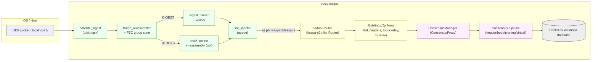
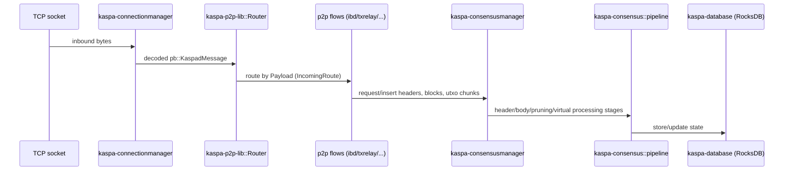

Below is a self‑contained design document you can hand to a Rust developer to start building a first cut.

---

# Satellite Ingest Path for `rusty‑kaspa` (digest‑first, optional blocks)

**Scope:** Add a one‑way “satellite ingest” side‑channel to `rusty‑kaspa` that consumes UDP frames on localhost carrying either (A) compact consensus digests (primary), or (B) optionally full/partial blocks. The node continues running normal TCP P2P and treats satellite data as an additional, untrusted information source.

**Assumptions:**

* Target branch: current master (1.0.1).
* Rollout: feature‑flagged; testnet/devnet only at first.
* Bandwidth goals: **digest** ≈ 10 kbps (≤ 50 kbps hard cap). **block** (optional) ≈ 256 kbps–1 Mbps.

---

## 1. Overview and Goals

**Goals**

1. Ingest a unidirectional local UDP stream containing Kaspa digests and/or (optionally) blocks.
2. Validate, de‑duplicate and enqueue satellite payloads into existing `rusty‑kaspa` processing paths without granting them elevated trust.
3. Prefer a design that keeps digest mode < 10 kbps sustained; block mode is experimental and may be disabled in production.
4. Ship behind a feature flag for testnet/devnet; production viability to be evaluated later.

**Non‑goals**

* We are not replacing P2P; this is a supplementary feed.
* We are not designing new consensus rules.
* We are not selecting final cryptographic primitives for digest commitments (we’ll specify choices + TBDs).

---

## 2. Background

### 2.1 Rusty‑Kaspa networking and block ingest (today)

At a high level:

```
TCP bytes
  → kaspa-connectionmanager (I/O, peers)
  → kaspa-p2p-lib::Router + IncomingRoute (message routing)
  → p2p flows (handshake, IBD, tx relay, block relay)
  → kaspa-consensusmanager (API over consensus)
  → kaspa-consensus::pipeline::{header_processor, body_processor, pruning_processor, virtual_processor}
  → RocksDB via kaspa-database (state, indices)
```

Pointers into the codebase (Rust crates published by the project):

* **`kaspa-connectionmanager`** manages inbound/outbound TCP connections and peer lifecycle. ([Docs.rs][1])
* **`kaspa-p2p-lib`** defines the **Router**, **IncomingRoute**, handshake, and most importantly **protobuf P2P messages** (module `pb` with types like `KaspadMessage`, `BlockHeaders`, `RequestNextHeaders`, `InvRelayBlock`, `RequestRelayBlocks`, `PruningPointProofMessage`, etc.). These are the canonical internal wire types used by flows. ([Docs.rs][2])
* **`kaspa-p2p-flows`** implements protocol “flows” on top of the Router (e.g., IBD streams of headers and “trusted entries”, transaction relay, etc.). See `v5/ibd/streams.rs` and `v5/txrelay/flow.rs` for concrete routing/read patterns and use of `Payload::*` message variants. ([Docs.rs][3])
* **`kaspa-consensusmanager`** is the API surface for consensus access from flows (the `ConsensusProxy` etc.). ([Docs.rs][4])
* **`kaspa-consensus`** hosts the processing pipeline:

  * `pipeline::header_processor`, `pipeline::body_processor`, `pipeline::pruning_processor`, `pipeline::virtual_processor`. ([Docs.rs][5])
  * Core processes include **GHOSTDAG**, pruning, pruning proofs, DAA, reachability, etc. (see `processes::{ghostdag, pruning, pruning_proof, difficulty, window, ...}`). ([Docs.rs][6])
* **`kaspa-database`** wraps RocksDB used by consensus/state. ([Docs.rs][7])

**Consensus & pruning concepts**
Kaspa uses a blockDAG with **GHOSTDAG** ordering and **second‑order pruning**. Pruning defines a **pruning point** and “kept set”; proofs/UTXO set chunks are exchanged during IBD via dedicated P2P payloads (`PruningPointProof*`, `PruningPointUtxoSetChunk`, etc.). ([Docs.rs][8])

**IBD & message flow examples (today)**

* Headers stream uses `Payload::BlockHeaders` / `DoneHeaders` and `RequestNextHeaders`. ([Docs.rs][3])
* Pruning‑related sync uses `RequestNextPruningPointAndItsAnticoneBlocks`, `PruningPointUtxoSetChunk`, etc. ([Docs.rs][3])

**Takeaway:** The cleanest way to “inject” alternate input is either:

* Pretend we’re a **special peer** at the P2P layer by producing valid **`pb::KaspadMessage`** items and pushing them into a `Router`/`IncomingRoute`; or
* Bypass P2P and call **consensus manager** entry points with `{Header, Block}` items directly (less code reuse, but simpler for digest‑only hints).

### 2.2 Summary of Blockstream Satellite (for patterns only)

**What they broadcast & how it lands locally**

* Blockstream’s **Bitcoin Satellite** is a **fork of Bitcoin Core** (via Bitcoin FIBRE) that **adds UDP multicast reception of blocks**; users run `bitcoind` with an `-udpmulticast=` option. You can verify operational status with RPCs like `getudpmulticastinfo` (you’ll see ~1.09 Mbps when locked) and `getchunkstats`. ([Blockstream][9])
* It is explicitly based on **FIBRE** (Fast Internet Bitcoin Relay Engine), a UDP + FEC block relay approach designed to be resilient to packet loss and to compress with compact blocks. ([Blockstream][9])
* Users install a custom node build; the **single‑direction RF link is demodulated by the receiver** and presented to the host as a **multicast UDP** stream, which `bitcoind` consumes. Trust can be toggled (`udpmulticast=...,...,trusted=1`), which changes validation/queueing behaviour, but the client remains a full validator. ([Blockstream][9])

**Integration points in Bitcoin Core (conceptually)**

* They **did not re‑implement consensus**; instead they added a **UDP ingest path** that **enqueues blocks** along normal validation pipelines. （The fork preserves all Core functionality while adding UDP multicast transport.) ([GitHub][10])

**Constraints and limitations (relevant to us)**

* The satellite path is **supplementary to P2P**: it’s a **receive‑only** feed for blocks. Operators can even run with `-connect=0` to rely on satellite for blocks, but many deployments also peer over the Internet/LAN to relay to other Core nodes. ([Blockstream][9])
* **FIBRE’s design** tolerates loss by sending extra parity/repair data (**FEC**) over UDP rather than relying on retransmission. (We’ll borrow the high‑level idea, but our local UDP producer will already have done FEC/repair before delivery to localhost.) ([bitcoinfibre.org][11])

---

## 3. Target Behaviours for Satellite Ingest

### 3.1 Parallel operation

* Node runs **normal TCP P2P** as today.
* If enabled, a **local UDP listener** consumes satellite frames concurrently.
* Satellite input is **never more trusted** than P2P; it is a **hint/extra feed**.

### 3.2 Payload classes

**A. Digest‑only mode (primary, bandwidth‑starved)**

* Satellite emits low‑rate **Consensus Digest** messages: compact state summaries derived from pruning point, DAA/GHOSTDAG state, and commitments to the kept set/UTXO state.
* Node:

  * Stores/verifies digests independently of P2P.
  * Uses digests to **track canonical state under poor connectivity** (e.g., for UI/telemetry, sync guidance, fast conflict detection).
  * On later full sync, checks that downloaded data **matches historic digests** (detecting eclipse inconsistencies).
* **Bandwidth target:** typical **3–10 kbps**, spikes ≤ 50 kbps (e.g., on pruning‑point events).

**B. Block payload mode (optional, experimental)**

* Satellite emits **full blocks** (or header + compacted bodies).
* Node reassembles, validates, and injects them into the **standard block validation pipeline**.
* Useful in lab/testnet and for benchmarking; may be disabled in mainnet production given Kaspa’s higher BPS.
* **Bandwidth model:** 256 kbps–1 Mbps (configurable), with FEC grouping at the satellite sender.

### 3.3 Failure and edge‑case behaviour

* **Conflicts with P2P:** Satellite input **never overrides** consensus rules; conflicts are treated like **competing peer data** → normal DAG/validation resolves it.
* **Missing/duplicate/out‑of‑order frames:** Reassembly is best‑effort with **bounded buffers** and **idempotent de‑dup** by content hash + sequence.
* **Replays:** Sequence windows + timestamps + digest epochs prevent unbounded replays; re‑accepting identical digests is harmless.

---

## 4. Proposed Architecture

### 4.1 Components and data flow



**Key idea:** We **reuse the P2P message layer** by building a **`VirtualRouter`** and pushing **well‑formed `pb::KaspadMessage`** items into the same per‑flow routes as if they arrived from a peer. This minimises bespoke code and keeps us inside the battle‑tested flows: `BlockHeaders`, `Block`, `InvRelayBlock`, `PruningPoint*`, etc. ([Docs.rs][8])

### 4.2 Interfaces and boundaries

**New module (crate or sub‑crate): `kaspa-satellite` (working name)**

* **`satellite_ingest::run(cfg: SatelliteConfig, inj: SatInjectorHandle) -> JoinHandle<()>`**
  Binds a UDP socket, decodes frames, handles FEC group boundaries (if present in framing), dispatches to **digest_parser**/**block_parser**.

* **`SatInjector`** (core interface between ingest and node):

  * `fn inject_digest(&self, d: DigestFrame) -> Result<()>`
  * `fn inject_block(&self, b: BlockFrame) -> Result<()>`
    Internally converts payloads to either **(A)** P2P **pb::KaspadMessage** items and **enqueue()** them into a **`kaspa-p2p-lib::Router`** instance configured as a **virtual inbound peer**, or **(B)** (design variant) calls consensus APIs directly (see alternatives below). ([Docs.rs][2])

* **Virtual peer implementation**

  * Implement a small helper that constructs a **`Router`** and a set of **`IncomingRoute`s** without a real TCP stream, registers to the same flows as `kaspa-connectionmanager` would after handshake, and feeds messages to them. The `kaspa-p2p-lib` layer exposes **`Router`, `IncomingRoute`, handshake helpers and message builders** (`make_message!(Payload::...)`). We can **skip real handshake** by fabricating a `Version/Verack` pair and marking the peer as local. ([Docs.rs][2])

**Injection choices**

* **Primary (recommended): “Special peer” approach at P2P layer**
  *Pros:* maximal reuse of **flows** (IBD, pruning UTXO chunks, relay semantics). Keeps one way to feed blocks/headers.
  *Cons:* some glue to emulate handshake/peer state.

* **Alternative:** Direct‑to‑consensus (bypass flows) for **digest‑only**
  *Pros:* simplest path to land low‑rate digests; avoids spurious flow routing.
  *Cons:* less reuse; you must maintain bespoke verification/storage logic alongside P2P.

### 4.3 Data structures (new)

**Framing (over UDP)**

```rust
#[repr(u8)]
pub enum SatStreamKind { DigestV1 = 0x01, BlockV1 = 0x02 }

#[repr(C)]
pub struct SatFrameHeader {
    magic: [u8; 4],          // b"SATK"
    version: u8,             // framing version == 1
    kind: u8,                // SatStreamKind
    network_id: u8,          // e.g. KaspaTest, KaspaDev (align with kaspa network IDs)
    flags: u8,               // bitfield: fec_present, fragmented, signed, ...
    seq: u64,                // monotonically increasing sequence (per-kind)
    group_id: u32,           // FEC group ID (0 if none)
    group_k: u16, group_n: u16, // FEC params (K-of-N) when fec_present=1
    frag_ix: u16, frag_cnt: u16, // fragment index/count if fragmented
    payload_len: u32,        // length of payload that follows
    header_crc32: u32,       // basic corruption guard
}
// followed by `payload_len` bytes of kind-specific payload
```

**Digest payload (see §5)**

```rust
pub struct DigestFrame {
    // fixed part (≈ 160–220 bytes depending on choices)
    version: u8,
    epoch: u64,                 // e.g. blue score or daa score epoching
    timestamp_ms: u64,          // coarse sender timestamp
    pruning_point: Hash32,
    pruning_proof_commitment: Hash32, // commitment/hash of serialized PruningPointProof
    utxo_muhash: Hash32,        // commitment to UTXO set at pruning point (or latest anchor)
    virtual_selected_parent: Hash32,
    virtual_blue_score: u64,
    daa_score: u64,
    blue_work: [u8; 32],        // or 16 if compressed; TBD
    kept_headers_mmr_root: Hash32, // optional; see §5
    // optional variable part (deltas):
    //   - short commitments to last N header IDs, or compact set of new blue mergeset tips
    // signature:
    signer_id: u16,             // identifies the broadcaster key (testnet)
    schnorr_sig64: [u8; 64],    // over the structured digest (TBD exact domain/tag)
}
```

**Block payload (optional)**

```rust
pub struct BlockFrame {
    // either full raw block as in pb::BlockMessage, or
    // header + compact body (transaction-ids shortids + prefilled txs) [TBD]
    // Keep payload <= ~60–120 KB per FEC group for 256–1024 kbps channels.
}
```

**Error/status reporting**

```rust
pub enum SatIngestError {
    MalformedFrame, UnsupportedVersion, BadCrc, UnknownKind,
    FecGroupIncomplete, FragmentMissing, Duplicate, QueueFull,
    VerifyFailed(String), // signature/commitment mismatch
}
```

### 4.4 Where this sits relative to current modules

* **Connection/P2P**: We **do not** touch `kaspa-connectionmanager`. Instead, the **VirtualRouter** becomes a local “peer” exposing the same `Router` API used by flows and pushes `pb::KaspadMessage` to the exact **IncomingRoute** handlers those flows already listen on (see `v5/ibd/streams.rs` and `v5/txrelay/flow.rs` for how they dequeue). ([Docs.rs][3])
* **Consensus**: Unchanged. All incoming data still traverses `kaspa-consensusmanager` and the `kaspa-consensus::pipeline::*` stages. ([Docs.rs][5])
* **Database**: Unchanged. Optionally we add a **satellite_digest** column family to store historic digests and verification statuses (pass/fail, matched anchor, etc.), piggybacking `kaspa-database`. ([Docs.rs][7])

### 4.5 Routing choices for injected messages

* **Block mode (opt):** Convert to **`pb::BlockMessage`** or **`pb::BlockHeaders` + request/response pairs** as appropriate and enqueue via Router. Let block/headers flows govern validation and re‑propagation. ([Docs.rs][8])
* **Digest mode:** Maintain a **separate queue** (bounded, back‑pressure) within `SatInjector`. Digest results **do not become P2P messages** by default; instead:

  * Update a **“satellite hints”** store and **metrics**.
  * Expose **RPC/metrics** so operators can see satellite lock, latest digest epoch, and any divergence with local state.

> **Design variant:** For certain digest subtypes that mirror existing proto (e.g., pruning proof), we can **re‑encode** to `pb::PruningPointProofMessage` and feed the IBD flow to accelerate sync on testnet. Validate carefully to avoid DOS vectors. ([Docs.rs][8])

### 4.6 Configuration and runtime controls

**CLI / config (YAML or CLI flags)**

* `--satellite.enable=[true|false]` (default false)
* `--satellite.listen=127.0.0.1:28515`
* `--satellite.mode=[digest|blocks|both]` (default `digest`)
* `--satellite.max_kbps=10` (hard throttle; default 10)
* `--satellite.queue_depth=1024` (digest), `--satellite.block_queue=32`
* `--satellite.require_signature=[true|false]` (default true in testnet)
* `--satellite.allowed_signers=[hex,...]` (testnet broadcaster keys)
* `--satellite.discard_unsigned=[true|false]` (default true)
* `--satellite.log_verbosity=[info|debug|trace]`

**Safe disable/fallback:** If the UDP bind fails or frames are malformed, log and continue normally (no effect on P2P).

### 4.7 Security / trust considerations

* **Local spoofing risk:** Any local process can send UDP. We must **require signatures** on digests (testnet: fixed public keys shipped in config). Unsigned digests are ignored (configurable for lab).
* **No consensus bypass:** Digest data never mutates consensus state on its own. Blocks from satellite **must** pass full validation exactly like blocks from TCP peers.
* **DOS resilience:**

  * **Framing sanity:** strict length caps; header CRC; drop on first error.
  * **Bounded buffers:** per‑kind ring buffers; reject when full with metrics.
  * **FEC limits:** enforce total N and K bounds; rate‑limit parity overhead to stay under configured kbps.
  * **De‑dup:** content‑hash + `seq` windows prevent queue floods from replays.
  * **Virtual peer priority:** mark the Router as **low‑priority** so it cannot starve other peers (e.g., dedicated channel sizes similar to `txrelay::invs_channel_size()` patterns). ([Docs.rs][12])

### 4.8 Error handling, logging, metrics

* **Counters:** frames received/dropped, CRC/FEC errors, duplicates, bytes/sec, digest epochs, signer acceptance rate, block reassembly success.
* **Events:** divergence detected (digest vs local tip), digest signature failure, pruning‑point mismatch.
* **Operator visibility:** expose via existing metrics/notify subsystems; add `getSatelliteInfo` RPC (parity with Bitcoin Satellite’s `getudpmulticastinfo` idea). ([Blockstream][9])

---

## 5. Digest Format (High‑Level Proposal)

**Design goals**

* Compact summaries to **anchor** the node’s view of the canonical DAG and to **commit** to data that will later be downloaded/validated over P2P.
* **Two layers**:

  1. **Snapshot digest** (infrequent; includes heavy commitments).
  2. **Delta digest** (frequent; tiny updates referencing the latest snapshot).

**Common fields (both types)**

* `version: u8`, `network_id: u8`, `epoch: u64` (e.g., **blue score** epoch or DAA epoch).
* `virtual_selected_parent: Hash32` (VSP) and `virtual_blue_score: u64` — compact pointer to the virtual’s chosen parent and overall progress.
* `daa_score: u64`, `blue_work: [u8; 32]` — progress/work indicators consistent with GHOSTDAG/DAA. (Names align with `GhostdagData` semantics.) ([Docs.rs][8])
* `timestamp_ms: u64` (sender time, coarse for replay windows).
* `signer_id: u16`, `schnorr_sig64: [u8; 64]` (signature over the canonical serialisation; testnet signer set shipped in config).

**Snapshot digest (≈ 200–320 bytes)**

* `pruning_point: Hash32`
* `pruning_proof_commitment: Hash32` — hash of the **serialised `PruningPointProofMessage`** that the node should later obtain over P2P during IBD. ([Docs.rs][8])
* `utxo_muhash: Hash32` — MuHash (or similar) of the UTXO set at the pruning point (Kaspa already ships `kaspa-muhash`). ([Docs.rs][3])
* `kept_headers_mmr_root: Hash32` — (TBD) commitment to the kept‑set headers via an MMR; helps detect header set tampering without listing them.

**Delta digest (≈ 80–120 bytes)**

* Minimal fields above plus a **compact accumulator** of recent headers (e.g., a rolling Bloom filter or XOR‑based sketch of last N header IDs) to cheaply signal progress without publishing every ID. Deltas reference the latest snapshot by `epoch` to bind them.

**Generation & verification**

* **Full node (broadcaster) generation:** For every `Δt` (e.g., 1 s), produce a delta; for every `T` (e.g., 30–60 s) or on pruning‑point change, produce a snapshot.
* **Receiver (our node) behaviour:**

  * Accept only **signed** digests from allowed signers (testnet).
  * Store digests and expose them via RPC/metrics.
  * During IBD or steady‑state, when we later fetch pruning proofs, headers and UTXO chunks via P2P flows (`PruningPointProofMessage`, `PruningPointUtxoSetChunk`, `BlockHeaders`, etc.), recompute commitments and **mark the corresponding digest as verified** or **flag divergence**. ([Docs.rs][3])

**Bandwidth accounting**

* **Typical:** 1 snapshot every 30 s (≈ 280 B) + 1 delta per second (≈ 100 B) → ≈ **~4.5 kbps**.
* **Stress:** on pruning‑point updates, an extra snapshot burst (still ≪ 50 kbps).
* Leaves headroom for signatures and FEC overhead within the **10 kbps** target.

> **TBDs for product/crypto:** precise domain separation and hash functions (BLAKE3 vs SHA‑256), MMR layout for `kept_headers_mmr_root`, compression of `blue_work`, signer key rotation/rollover.

---

## 6. Alternative Approaches / Design Variants

1. **Direct‑to‑Consensus for Blocks**
   Instead of building a virtual peer, parse a `BlockFrame` and feed blocks through a `ConsensusManager` API (e.g., via a `BlockProcessingBatch`).

   * **Pros:** thinner layer, fewer moving parts.
   * **Cons:** you lose the P2P flow’s natural back‑pressure and state machines (e.g., header/UTXO sequencing). Requires explicit re‑implementation of some IBD choreography. ([Docs.rs][4])

2. **RPC‑level injection**
   Expose an internal RPC that accepts blocks/digests.

   * **Pros:** good for tests.
   * **Cons:** bypasses a lot of production logic; less realistic.

**Recommendation:** Start with the **VirtualRouter** (primary), keep **Direct‑to‑Consensus** for digest‑only testing.

---

## 7. Testing and Rollout Plan

### 7.1 Unit tests

* **Frame parsing:** header CRC, version/kind checks, fragmentation, FEC grouping acceptance/rejection.
* **Digest validation:** signature verification; commitment recomputation stubs with test vectors; epoch windows.
* **De‑dup/replay:** fixed sequence windows; duplicate drop; window slide.

### 7.2 Integration tests

* **Node + P2P + satellite:** spawn a node with `--satellite.enable` plus a UDP test harness that emits:

  * **Digest‑only** stream for N minutes; assert metrics (epochs advance; no consensus mutation).
  * **Blocks:** feed a small devnet with synthetic blocks; assert that blocks accepted via satellite appear identical to TCP‑fetched blocks (same hashes, same DAG relations).
* **Reconnect scenario:** run with **only digests** for a while (no P2P), then reconnect to full peers and **verify** that downloaded pruning proof/UTXO/header commitments match stored digests.
* **Adverse conditions:**

  * **Packet loss/reorder:** drop 10–20% of UDP frames pre‑FEC; assert FEC/dedup behaviour.
  * **Replay/duplicate:** resend old frames; ensure replays are detected and harmless.
  * **Malicious digests:** bad signature, wrong commitments; assert rejection, no consensus impact, counters increment.

### 7.3 Phased rollout (testnet/devnet only)

1. **Local lab simulation (no RF):** UDP generator feeding digests/blocks; iterate quickly.
2. **RF PoC:** SDR or hardware receiver emits the same UDP framing to localhost.
3. **Testnet deployment:** fixed set of **allowed_signers**; publish operator docs and metrics.
4. **Evaluate mainnet viability:** based on telemetry and product risk review (especially bandwidth and DOS exposure).

---

## 8. Open Questions and Decisions Required

1. **Digest crypto choices**

   * Hash family (BLAKE3 vs SHA‑256) and exact serialisation for `pruning_proof_commitment`.
   * Whether to adopt **MMR** for `kept_headers_mmr_root` now or defer.
   * Signature scheme: stick with `secp256k1::schnorr` (available in dependencies) and a small signer set for testnet.

2. **How often to snapshot vs delta**

   * Default cadence (suggested: 1 snapshot / 30–60 s; 1 delta / 1 s).
   * Backoff rules when bandwidth headroom is low (auto‑throttle to maintain ≤ 10 kbps).

3. **Block mode framing**

   * Full block vs header+compact body. (The latter reduces bandwidth but adds complexity.)
   * FEC K/N and maximum fragment sizes matched to 256 kbps–1 Mbps channels.

4. **Injection locus for digests**

   * Keep digests as **off‑to‑the‑side hints** (recommended) vs converting some into P2P payloads (e.g., pruning proof messages) in testnet.

5. **Trust & signer policy** (testnet)

   * Where to publish the broadcaster keys; rotation cadence; how nodes fetch updated keys.

---

## Appendix A — Data‑Path Walkthrough (today) with code touchpoints



**Concrete references**

* Message types: `pb::{KaspadMessage, BlockHeaders, RequestNextHeaders, InvRelayBlock, PruningPointProofMessage, PruningPointUtxoSetChunk, ...}`. ([Docs.rs][8])
* IBD streams and request cadence: `v5/ibd/streams.rs` uses `Payload::BlockHeaders`, `DoneHeaders`, and issues `RequestNextHeaders`. ([Docs.rs][3])
* Transaction relay shows the **routing pattern** and channel sizing (`invs_channel_size()`) we’ll mimic for the virtual peer. ([Docs.rs][12])
* Consensus pipeline module map: `pipeline::{header_processor, body_processor, pruning_processor, virtual_processor}`. ([Docs.rs][5])

---

## Appendix B — Satellite‑side framing to P2P mapping

| Satellite kind  | Frame payload → P2P injection                                                                                        |
| --------------- | -------------------------------------------------------------------------------------------------------------------- |
| `DigestV1`      | Parsed → stored in `satellite_digest` CF; exposed via `getSatelliteInfo`; optional cross‑checks against local state. |
| `BlockV1` (opt) | Raw block → `pb::BlockMessage` to Router; or header(s) → `pb::BlockHeaders`; flows handle the rest. ([Docs.rs][8])   |

---

## Appendix C — Config examples

```
# kaspad.toml (testnet)
[satellite]
enable = true
listen = "127.0.0.1:28515"
mode = "digest"
max_kbps = 10
require_signature = true
allowed_signers = ["02ab...","03cd..."]
queue_depth = 1024
log_verbosity = "info"
```

---

## Appendix D — Notes on Blockstream’s model we are reusing

* **Unidirectional UDP** delivery to a node that **feeds normal validation**, not a new consensus. ([GitHub][10])
* **Operator ergonomics**: provide a **simple on/off config**, diagnostics (cf. `getudpmulticastinfo`), and clear status logs. ([Blockstream][9])
* **FEC upstream, not in consensus**: tolerate loss in the transport; once data reaches the node it must be syntactically/semantically valid or dropped. (FIBRE background.) ([bitcoinfibre.org][11])

---

## Appendix E — Testnet vs Mainnet assumptions

* **Testnet/devnet**: lower economic risk, easier to fix allowed signers, and bandwidth/SLA less critical. We assume higher variance in BPS on testnets and simpler pruning settings.
* **Mainnet**: significantly higher BPS targets advertised by Kaspa marketing (10 BPS today, aiming higher), which makes **block mode** over satellite likely impractical at low rates; digest mode remains viable. ([Kaspa][13])

---

### Implementation sketch (first tasks for a dev)

1. Create `kaspa-satellite` crate (or `components/satellite` module).
2. Implement `SatFrameHeader` parser + CRC; add unit tests.
3. Implement `SatInjector` and a **VirtualRouter** that can enqueue `pb::KaspadMessage` items to **existing flows** (use `make_message!(Payload::...)`). ([Docs.rs][2])
4. Wire feature flag + config; start a `tokio` task to `run()` the UDP listener.
5. Implement **DigestV1** end‑to‑end: parse, signature verify, store, RPC/metrics.
6. (Optional) Implement **BlockV1** → `pb::BlockMessage` injection; run devnet integration tests.
7. Add **`getSatelliteInfo`** RPC (status, rates, latest epoch, divergence flags).
8. Write **property tests** for de‑dup/replay windows and FEC‑group handling (even if the first satellite source provides already repaired frames, keep the structure for future flexibility).

---

**References to code/docs cited above (load‑bearing):**

* P2P protobuf and Router types + macros (`pb::`, `Router`, `IncomingRoute`, `make_message!`). ([Docs.rs][2])
* IBD and relay flow examples that show how messages are consumed/produced. ([Docs.rs][3])
* Consensus pipeline modules and processes (GHOSTDAG, pruning, pruning proofs). ([Docs.rs][5])
* RocksDB usage via `kaspa-database`. ([Docs.rs][7])
* Blockstream Bitcoin Satellite: UDP multicast option, RPCs, integration stance; FIBRE/UDP/FEC background. ([Blockstream][9])

---

### Why this stays under 10 kbps (digest mode)

* **Snapshot digest** ~ 280 B every 30–60 s + **delta** ~ 100 B/s → ≈ 3–5 kbps typical (plus small framing/signature/FEC overhead).
* Peak events (pruning‑point change) add temporary bursts but remain **≪ 50 kbps** and are infrequent.
* Throttles enforce a hard cap: when the running average approaches the configured `max_kbps`, we drop delta frequency before snapshot cadence.

---

### Call‑outs for reviewers

* We deliberately **do not** short‑circuit consensus: satellite blocks must navigate the same flows and checks.
* Digest signatures make this usable over untrusted local networks (e.g., containers, shared hosts).
* VirtualRouter reuse keeps the surface area small and piggybacks on existing back‑pressure and message accounting.

If you’d like, I can put a skeleton crate (module layout, config parsing, UDP loop, and a `DigestV1` parser with unit tests) in place next.

[1]: https://docs.rs/kaspa-connectionmanager?utm_source=chatgpt.com "kaspa_connectionmanager - Rust"
[2]: https://docs.rs/kaspa-p2p-lib "kaspa_p2p_lib - Rust"
[3]: https://docs.rs/kaspa-p2p-flows/latest/src/kaspa_p2p_flows/v5/ibd/streams.rs.html "streams.rs - source"
[4]: https://docs.rs/kaspa-consensusmanager?utm_source=chatgpt.com "kaspa_consensusmanager - Rust"
[5]: https://docs.rs/kaspa-consensus/latest/kaspa_consensus/pipeline/index.html "kaspa_consensus::pipeline - Rust"
[6]: https://docs.rs/kaspa-consensus/latest/kaspa_consensus/processes/index.html "kaspa_consensus::processes - Rust"
[7]: https://docs.rs/kaspa-database?utm_source=chatgpt.com "kaspa_database - Rust"
[8]: https://docs.rs/kaspa-p2p-lib/latest/kaspa_p2p_lib/pb/index.html "kaspa_p2p_lib::pb - Rust"
[9]: https://blockstream.github.io/satellite/doc/bitcoin.html "Bitcoin Satellite | Blockstream Satellite"
[10]: https://github.com/Blockstream/bitcoinsatellite?utm_source=chatgpt.com "Blockstream/bitcoinsatellite: Bitcoin Satellite"
[11]: https://bitcoinfibre.org/?utm_source=chatgpt.com "FIBRE Fast Internet Bitcoin Relay Engine"
[12]: https://docs.rs/kaspa-p2p-flows/latest/src/kaspa_p2p_flows/v5/txrelay/flow.rs.html?utm_source=chatgpt.com "kaspa_p2p_flows/v5/txrelay/ flow.rs"
[13]: https://kaspa.org/features/?utm_source=chatgpt.com "Features"
